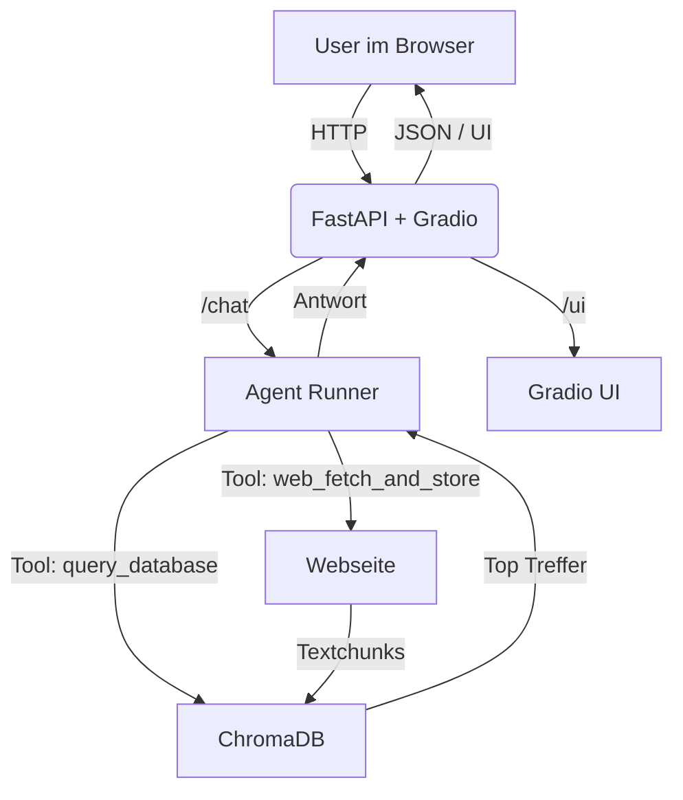
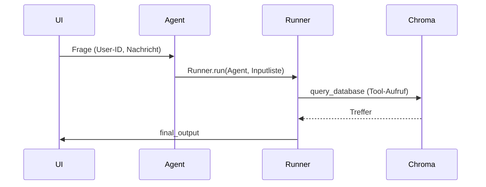

# RAG Agent – Technische Dokumentation

Diese Anleitung beschreibt den Aufbau und den Betrieb der Anwendung `rag_agent_app.py`. Die App kombiniert FastAPI, Gradio und ChromaDB, um einen Retrieval-Augmented-Generation-Agenten (RAG) zu demonstrieren, der auf OpenAIs Responses-API basiert.

## Gesamtüberblick



- **Gradio UI** (`/ui`) bietet ein Chat-Interface, einen Seed-Button und eine direkte Wissensbasis-Suche.
- **FastAPI** stellt REST-Endpunkte (`/chat`, `/seed_example_users`) bereit, die auch ohne Browser genutzt werden können.
- **Agentenlogik** (in `rag_agent/agent.py`) orchestriert Tools, Historie und OpenAI-Responses.
- **ChromaDB** (lokal via Docker-Container) speichert die Wissensbasis und Retrieval-Ergebnisse.

## Verzeichnisstruktur

```
.
├── rag_agent_app.py         # Entrypoint / Uvicorn-Startscript
├── rag_agent/
│   ├── __init__.py
│   ├── agent.py             # Agent, Runner und Gesprächshistorie
│   ├── api.py               # FastAPI-Router mit /chat & /seed
│   ├── application.py       # FastAPI-Factory + Gradio-Mount
│   ├── schemas.py           # Pydantic-Modelle
│   ├── seeding.py           # Seed-Daten für Chroma
│   ├── settings.py          # Konfiguration (ENV, Titel, Host/Port)
│   ├── tools.py             # Tools für Agent und UI
│   ├── ui.py                # Gradio-Blocks-Definition
│   └── vector_store.py      # Chroma-Hilfsfunktionen
├── rag_agent_readme.md      # Diese Dokumentation
└── rag_agent_docker_chroma.md# Hinweise zum Starten von Chroma
```

## Komponenten im Detail

### 1. Konfiguration (`rag_agent/settings.py`)
- Lädt `.env`-Werte, insbesondere `OPENAI_API_KEY`, `CHROMA_HOST`, `CHROMA_PORT`.
- Definiert Titel/Beschreibung für FastAPI & UI.

### 2. Vektorstore (`rag_agent/vector_store.py`)
- Initialisiert `OpenAIEmbeddingFunction` und den `chromadb`-Client.
- Bietet Funktionen zum Chunking, Hinzufügen und Semantik-Suchen (`semantic_query`).
- Formatiert Ergebnisse für den Agenten und die UI (`format_query_results`).

### 3. Tools (`rag_agent/tools.py`)
- `query_database_logic`: Wiederverwendbare Retrieval-Logik.
- `query_database`: Als Agent-Tool dekoriert.
- `web_fetch_and_store_logic`: Ruft eine URL ab (Timeout 5s), chunked den Text und speichert ihn in Chroma (Fehlermeldungen bei Netzwerkproblemen).
- `web_fetch_and_store`: Agent-Tool; UI nutzt die Logik direkt nicht mehr.

### 4. Agent (`rag_agent/agent.py`)
- Erstellt `OpenAIResponsesModel` und `Agent` mit Instruktionen + Tools.
- `conversation_histories`: In-Memory-Chatverlauf pro Nutzer-ID.
- `run_agent_turn`: Führt den Agenten mit historischer Konversation aus und aktualisiert die Historie.
- `clear_conversation`: Löscht Historie für eine ID.



### 5. API (`rag_agent/api.py`)
- `/chat`: Nimmt `ChatRequest` (`user_id`, `message`) entgegen, ruft `run_agent_turn` und gibt `response` zurück.
- `/seed_example_users`: Ruft `seed_example_documents` auf; liefert Anzahl eingefügter Dokumente.

### 6. Gradio UI (`rag_agent/ui.py`)
- `create_gradio_blocks`: Baut Blocks-Layout mit ChatInterface, Seed-Button, Direkt-Suche.
- Chat nutzt `handle_gradio_chat` (validiert User-ID, ruft `run_agent_turn`).
- Direkt-Suche (`handle_db_preview`) zeigt Top-Treffer aus Chroma.
- Seed-Button (`handle_seed_wissensbasis`) füllt Beispiel-Dokumente nach.
- Clear-Button (`handle_clear_history_ui`) setzt Chat-Historie zurück.

### 7. FastAPI Factory (`rag_agent/application.py`)
- Erstellt `FastAPI`, bindet API-Router ein, mountet Gradio unter `/ui`.
- Nutzung in `rag_agent_app.py` für den Produktionsstart.

## Lokale Inbetriebnahme

1. **ChromaDB starten** (Docker, siehe `rag_agent_docker_chroma.md`):
   ```bash
   docker run -d -p 8000:8000 \
      -v $(pwd)/chroma_data:/chroma/.chroma/index \
      --name chroma-server chromadb/chroma
   ```

2. **Dependencies installieren** (OpenAI, FastAPI, Gradio, Chroma):
   ```bash
   uv sync
   ```

3. **Umgebungsvariablen setzen** (`.env`):
   ```env
   OPENAI_API_KEY="sk-..."
   CHROMA_HOST="localhost"
   CHROMA_PORT="8000"
   ``

4. **App starten**:
   ```bash
   uv run rag_agent_app.py
   ```
   oder 
   ```bash
   uvicorn rag_agent_app:app --reload --port 8080
   ```

5. **UI öffnen**: [http://localhost:8080/ui](http://localhost:8080/ui)

## Typischer Workflow

1. Optional Seed-Daten laden (`Beispielwissen laden`).
2. Direkt-Suche (`Semantische Vorschau`) testen, um die Wissensbasis zu prüfen.
3. Im Chat Fragen stellen (`demo-user` bleibt aktiv). Der Agent nutzt `query_database` und ggf. `web_fetch_and_store`.
4. Chat-Historie zurücksetzen (`Konversation leeren`), um einen neuen Kontext zu starten.

## Fehlerbehebung

| Problem | Ursache | Lösung |
|---------|---------|--------|
| `OPENAI_API_KEY` nicht gesetzt | ENV fehlt | `.env` anlegen oder Export in Shell |
| `web_fetch_and_store` meldet Netzwerkfehler | Umgebung blockiert ausgehende HTTP-Requests | Funktioniert nur in Umgebung mit Internetzugang |
| Chroma-Verbindung fehlschlägt | Docker-Container nicht gestartet oder falscher Port | Container gemäß Anleitung starten, Host/Port prüfen |
| UI zeigt leere Treffer | Wissensbasis ist leer | `Beispielwissen laden` klicken oder eigene Dokumente hinzufügen |

## Tests & Validierung

- Syntaxprüfung via `python -m compileall rag_agent`.
- Funktionale Tests: Starten der App, Seed ausführen, Direkt-Suche, Chat-Interaktion.

## Weiterführende Anpassungen

- Eigene Seed-Datensätze hinzufügen (siehe `rag_agent/seeding.py`).
- Gesprächshistorien persistent speichern (statt in-memory Dict).
- UI erweitern (z. B. Upload-Funktion für Dokumente).
- Authentifizierung für API/Gradio ergänzen.

